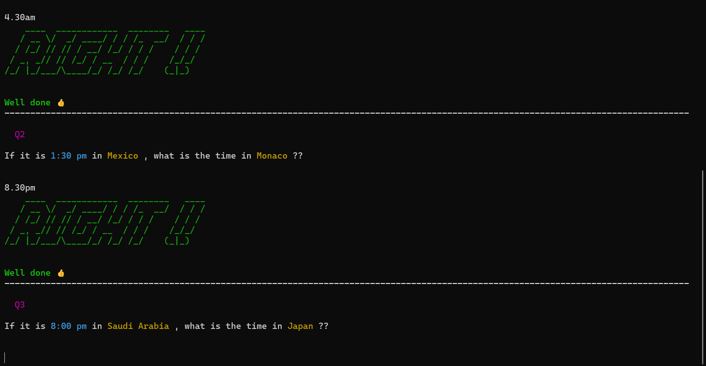

# TIME ZONE TEACHER
#### Video Demo:  https://youtu.be/4jnFy9hBDBk
#### Description: 
Teaches you time zones of various countries through quiz

## Table of Contents
* [General Info](#general-information)
* [Technologies Used](#technologies-used)
* [Features](#features)
* [Screenshots](#screenshots)
* [Setup and Usage](#setup-and-usage)
* [Make-up of Program](#make-up-of-program)
* [Design Choices](#design-choices)
* [Acknowledgements](#acknowledgements)
* [Contact](#contact)
<!-- * [License](#license) -->

## General Information
- Used to learn the time zones of various countries, and test yourselves through quizzes
- Made as final project for **_CS50 Python_** course
- Many people struggle to work out what the approximate time is in other countries. Sure you can use your phone, but that is not be as fast or as impressive
- This skill may be useful when debating whether to call your friend or relative in another country because it may be too late or too early for them.
- I created this program because I thought it was a relevant problem and one that could test my abilities as a Python programmer

## Technologies Used
- Python  - version 3.11
- Regex 

## Features
- Quiz contains an Easy mode and a Hard mode. In Easy mode, the hardest question you get are times like 3:00 pm, 11:00 am etc. The Hard mode includes that and times like 7:30 pm, 2:30 pm etc. 
(I felt that rounding to the nearest half-hour was enough since we only want the approx. time)
- You can enter times in a variety of formats and the program will convert to it to a single format, courtesy of regex. eg. 12am, 12.00 am, 12:00AM etc.
- Even though the whole program runs natively within the Terminal, I've taken the time to make it colorful and interesting by using text colors, emojis, figlet fonts and separators. 

## Screenshots

  

## Setup and Usage
Install the required packages using `pip install requirements.txt`

Run the program by **cd**-ing into the directory and typing `python project.py`

## Make-up of Program
There are three main files pertaining to the program-

1. The `project.py` is the main program containing functions such as *display()* and *quiz()*

2. `test_project.py` is used for testing the important functions of the main program such as *time_diff()*, *check()* and *right_ans()* 

3. In the `country_times.csv`, the countries and their time differences are stored as a list of dictionaries

## Design Choices
* I debated between using an external csv file and a dictionary in the main program itself. But that would make the program longer than it already is

* The hardest part of the project was undoubtedly the logic part of the program that was used to find the right answer. After trying and failing to use the 12-hour format, I shifted to the 24-hour format and managed to make it work

* Since everything was done within the terminal, I made liberal use of libraries such as **termcolor** and **pyfiglet** to introduce some color and variety. 

## Acknowledgements
- This project was done as a part of CS50 Python course
- Many thanks to Prof. David Jay Malan who taught the course so well!

## Contact
Created by Abhishikth Paul - abhishikthpaul@gmail.com

Project link: https://github.com/Abhishikthpaul/TimeZoneTeacher.git

<!-- ## License -->
<!-- This project is open source and available under the [... License](). -->

